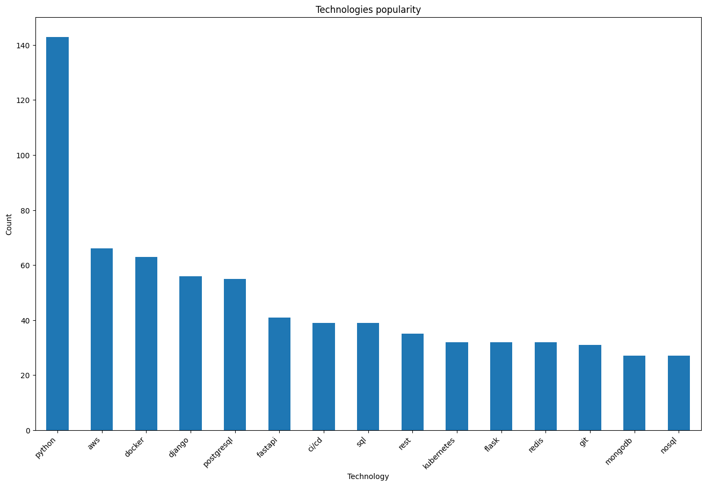
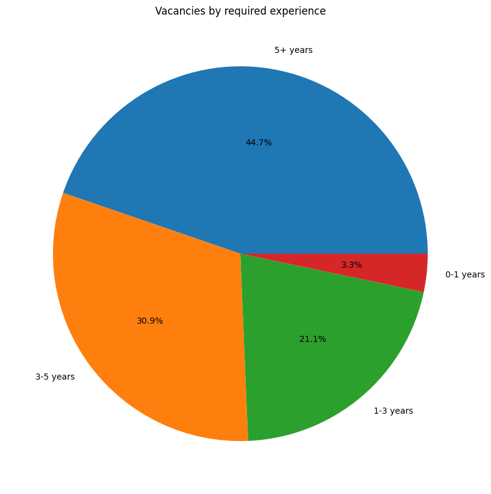
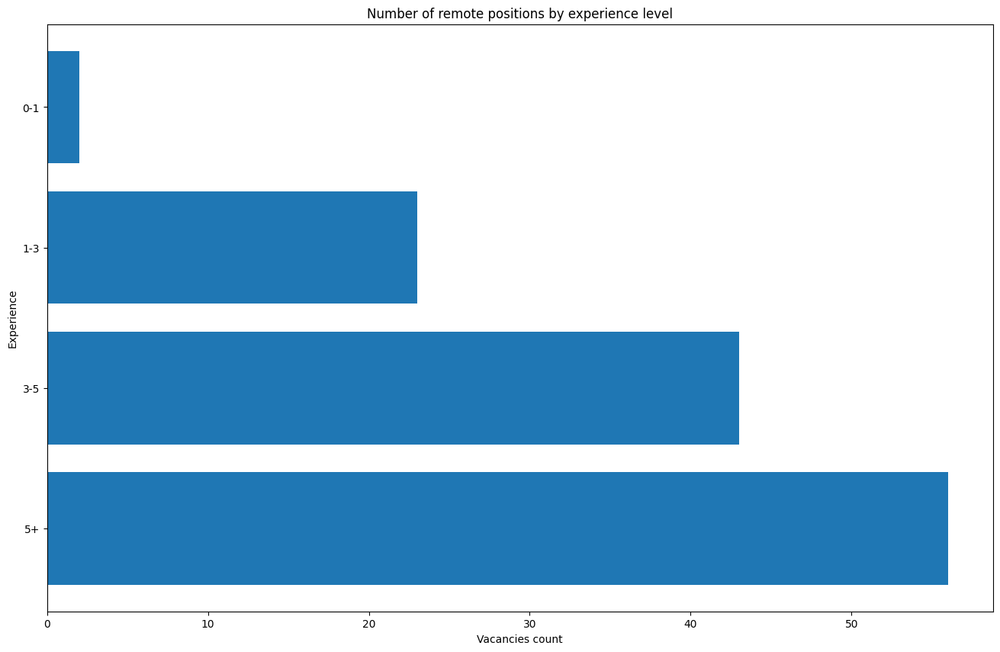

# Web scraping and data analysis 📊

This project allows you to quickly and efficiently collect data on vacancies from a website, analyze it and build corresponding dependency diagrams

## Features:
- Parses DOU website and collects data for chosen category (Python, Java, C/C++, etc) vacancies.
- Stores collected data in a CSV file (configurable through "scrapy" settings).
- The scraper is based on "selenium" (for interactive page elements) and "scrapy"
- Analyzes data with a user-friendly interface in Jupyter, as well as data processing library like Pandas.
- Visualizes data using the Matplotlib library and saves graphs in chosen format in the "plots" folder.

## How to run

1. **Clone repository**
```shell
git clone https://github.com/BastovOleksandr/web-scraping-and-data-analysis.git
cd web-scraping-and-data-analysis
```
2. **Create a virtual environment (optional but recommended):**
```bash
python -m venv venv
```
3. **Activate the virtual environment:**
- On Windows:
    ```bash
    venv\Scripts\activate
    ```
- On Unix or MacOS:
    ```bash
    source venv/bin/activate
    ```
4. **Install dependencies:**
```shell
pip install -r requirements.txt
```
5. **Scrape data by running the corresponding spider:**<br>(configure scraper if needed inside "scraper_config.py")
```shell
scrapy crawl vacancies
```
6. **After 'vacancies.csv' file appearing in projects root dir, you have two options:**<br>(configure scraper if needed inside "analysis_config.py")
- Run full analysis, all plots will be saved inside 'plots' directory:
    ```bash
    jupyter nbconvert --to notebook --execute data_analysis.ipynb
    ```
- Open "data_analysis.ipynb" and run the first cell at least once, others on your own:

## Plots examples



